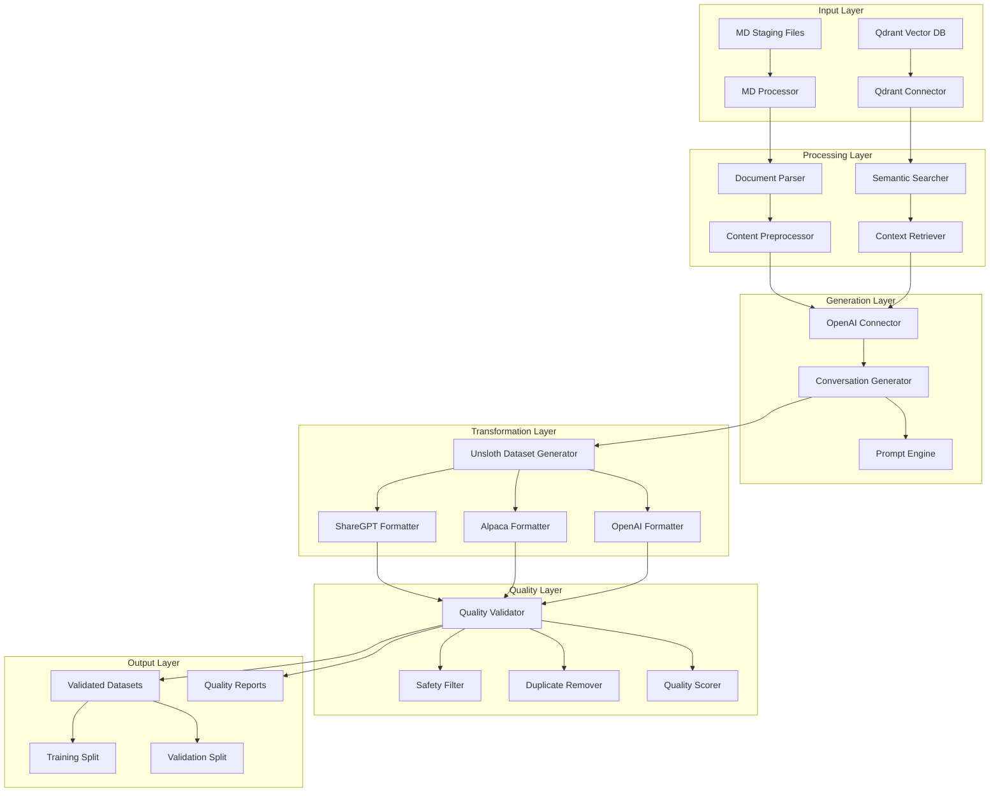
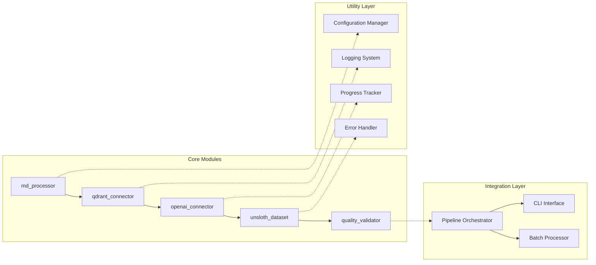

# Design Document

## Overview

Syncfusion WinForms 문서를 기반으로 한 LLM 미세조정용 Unsloth 데이터셋 생성 시스템의 설계 문서입니다. 이 시스템은 MD 파일 처리부터 벡터 데이터베이스 연동, AI 기반 대화 생성, 다중 포맷 변환, 품질 검증까지의 전체 파이프라인을 자동화하여 고품질의 훈련 데이터셋을 생성합니다.

## Architecture

### System Architecture



### Module Architecture



## Components and Interfaces

### 1. MD Processor Module

**Purpose**: Syncfusion WinForms MD 문서 파일을 스캔, 파싱, 전처리하여 구조화된 데이터로 변환

**Key Components**:
- `MDFileScanner`: 파일 시스템 스캔 및 메타데이터 추출
- `MDParser`: 마크다운 콘텐츠 파싱 및 구조 분석
- `ContentPreprocessor`: 텍스트 정규화 및 코드 예제 처리
- `MetadataExtractor`: API 시그니처 및 컴포넌트 정보 추출

**Interfaces**:
```python
class MDProcessor:
    def process_documents(self, output_path: Path) -> List[Dict[str, Any]]
    def scan_files(self, base_paths: List[str]) -> Iterator[FileMetadata]
    def parse_content(self, file_path: Path) -> DocumentMetadata
    def extract_api_signatures(self, content: str) -> List[Dict[str, Any]]
```

**Data Flow**:
1. 파일 스캔 → 메타데이터 추출 → 콘텐츠 파싱 → 구조화된 문서 생성

### 2. Qdrant Connector Module

**Purpose**: Qdrant 벡터 데이터베이스와 연동하여 의미적 검색 및 컨텍스트 검색 수행

**Key Components**:
- `QdrantConnectionManager`: 연결 관리 및 상태 모니터링
- `QdrantDocumentSearcher`: 의미적 검색 및 유사도 계산
- `QdrantDataTransformer`: 검색 결과 변환 및 정규화
- `IntegratedDocumentProcessor`: 로컬 문서와 벡터 DB 통합 처리

**Interfaces**:
```python
class QdrantConnector:
    def search_documents(self, query: str, limit: int = 10) -> List[SearchResult]
    def search_by_metadata(self, filter: Dict[str, Any]) -> List[SearchResult]
    def batch_search(self, queries: List[str]) -> List[BatchSearchResult]
    def get_similar_documents(self, doc_id: str) -> List[SearchResult]
```

**Data Flow**:
1. 쿼리 입력 → 벡터 임베딩 → 유사도 검색 → 결과 변환 → 컨텍스트 반환

### 3. OpenAI Connector Module

**Purpose**: OpenAI 호환 API를 통해 LLM 기반 대화 데이터셋 생성

**Key Components**:
- `OpenAIClient`: API 클라이언트 및 연결 관리
- `PromptEngine`: 프롬프트 템플릿 관리 및 생성
- `ConversationGenerator`: 대화 생성 로직 및 품질 제어
- `TokenManager`: 토큰 최적화 및 컨텍스트 관리

**Interfaces**:
```python
class OpenAIConnector:
    async def generate_conversations(self, documents: List[Dict], target_count: int) -> List[Conversation]
    async def generate_single_conversation(self, context: Dict) -> Conversation
    def create_prompt(self, template: str, context: Dict) -> str
    def optimize_tokens(self, text: str, max_tokens: int) -> str
```

**Data Flow**:
1. 문서 컨텍스트 → 프롬프트 생성 → LLM 호출 → 응답 파싱 → 대화 구조화

### 4. Unsloth Dataset Generator Module

**Purpose**: 생성된 대화를 Unsloth 호환 다중 포맷으로 변환

**Key Components**:
- `UnslothDatasetGenerator`: 메인 데이터셋 생성 엔진
- `ShareGPTFormatter`: ShareGPT 포맷 변환기
- `AlpacaFormatter`: Alpaca 포맷 변환기
- `OpenAIFormatter`: OpenAI 포맷 변환기
- `UnslothValidator`: Unsloth 호환성 검증

**Interfaces**:
```python
class UnslothDatasetGenerator:
    def generate_datasets(self, conversations: List[Dict]) -> DatasetGenerationResult
    def format_to_sharegpt(self, conversations: List[Dict]) -> List[Dict]
    def format_to_alpaca(self, conversations: List[Dict]) -> List[Dict]
    def format_to_openai(self, conversations: List[Dict]) -> List[Dict]
    def validate_unsloth_compatibility(self, dataset: List[Dict]) -> ValidationResult
```

**Data Flow**:
1. 대화 입력 → 포맷별 변환 → 호환성 검증 → 훈련/검증 분할 → JSONL 출력

### 5. Quality Validator Module

**Purpose**: 데이터셋 품질 검증, 필터링, 자동 수정

**Key Components**:
- `SafetyFilter`: 안전성 및 적절성 검증
- `DuplicateRemover`: 중복 탐지 및 제거
- `QualityScorer`: 품질 점수 계산 (ROUGE, BERT-score)
- `CompatibilityChecker`: Unsloth 호환성 검증
- `AutoCorrector`: 자동 오류 수정
- `StatisticsAnalyzer`: 데이터셋 통계 분석

**Interfaces**:
```python
class QualityValidator:
    def validate_and_filter(self, datasets: Dict[str, List[Dict]]) -> Dict[str, List[ValidationResult]]
    def check_safety(self, content: str) -> SafetyResult
    def detect_duplicates(self, items: List[Dict]) -> DuplicateResult
    def calculate_quality_score(self, item: Dict) -> QualityResult
    def generate_report(self, results: Dict) -> Dict[str, Any]
```

**Data Flow**:
1. 데이터셋 입력 → 안전성 검증 → 중복 제거 → 품질 점수 계산 → 자동 수정 → 검증된 데이터셋 출력

## Data Models

### Core Data Structures

```python
@dataclass
class DocumentMetadata:
    """문서 메타데이터"""
    file_path: str
    component_name: str
    page_number: Optional[int]
    title: str
    content_hash: str
    api_signatures: List[Dict[str, Any]]
    code_examples: List[str]
    creation_time: datetime
    file_size: int
    quality_score: float

@dataclass
class Conversation:
    """대화 데이터 구조"""
    id: str
    conversations: List[Dict[str, str]]  # [{"from": "human/gpt", "value": "..."}]
    metadata: Dict[str, Any]
    source_documents: List[str]
    generation_timestamp: datetime
    quality_metrics: Dict[str, float]

@dataclass
class DatasetGenerationResult:
    """데이터셋 생성 결과"""
    datasets: Dict[str, List[Dict[str, Any]]]  # format -> data
    statistics: Dict[str, Any]
    validation_results: Dict[str, Any]
    file_paths: Dict[str, str]
    generation_metadata: Dict[str, Any]

@dataclass
class ValidationResult:
    """검증 결과"""
    id: str
    conversations: List[Dict[str, Any]]
    metadata: Dict[str, Any]
    quality_validation: Dict[str, Any]
    is_valid: bool
    validation_passed: bool
    statistics: Dict[str, Any]
```

### Configuration Models

```python
@dataclass
class PipelineConfig:
    """파이프라인 전체 설정"""
    # API 설정
    openai_endpoint: str = "http://123.37.28.120:9997/v1"
    openai_model: str = "qwen2.5-vl-instruct"
    qdrant_host: str = "100.88.88.88"
    qdrant_port: int = 6333
    qdrant_collection: str = "ws-7491d651ae044c78"
    
    # 데이터 설정
    target_count: int = 5000
    max_seq_length: int = 8192
    formats: List[str] = field(default_factory=lambda: ["sharegpt", "alpaca", "openai"])
    
    # 품질 설정
    min_quality_score: float = 0.7
    safety_threshold: float = 0.8
    enable_auto_correction: bool = True
    
    # 성능 설정
    batch_size: int = 16
    max_concurrent: int = 8
    test_mode: bool = False
```

## Error Handling

### Error Categories

1. **Connection Errors**: API 연결 실패, Qdrant 연결 오류
2. **Data Processing Errors**: 파일 파싱 오류, 형식 변환 실패
3. **Generation Errors**: LLM 응답 오류, 토큰 한계 초과
4. **Validation Errors**: 품질 검증 실패, 호환성 오류
5. **I/O Errors**: 파일 읽기/쓰기 오류, 권한 문제

### Error Handling Strategy

```python
class ErrorHandler:
    """통합 오류 처리기"""
    
    def handle_connection_error(self, error: Exception) -> bool:
        """연결 오류 처리 (재시도 로직)"""
        
    def handle_processing_error(self, error: Exception, context: Dict) -> Optional[Any]:
        """처리 오류 처리 (복구 시도)"""
        
    def handle_generation_error(self, error: Exception) -> bool:
        """생성 오류 처리 (대안 전략)"""
        
    def log_error(self, error: Exception, context: Dict):
        """구조화된 오류 로깅"""
```

### Retry Mechanisms

- **Exponential Backoff**: API 호출 실패 시 지수적 대기
- **Circuit Breaker**: 연속 실패 시 일시적 중단
- **Graceful Degradation**: 부분적 실패 시 가능한 부분만 처리
- **Fallback Strategies**: 주요 기능 실패 시 대안 방법 사용

## Testing Strategy

### Unit Testing

```python
class TestMDProcessor:
    def test_file_scanning(self):
        """파일 스캔 기능 테스트"""
        
    def test_content_parsing(self):
        """콘텐츠 파싱 테스트"""
        
    def test_api_signature_extraction(self):
        """API 시그니처 추출 테스트"""

class TestQdrantConnector:
    def test_connection_management(self):
        """연결 관리 테스트"""
        
    def test_semantic_search(self):
        """의미적 검색 테스트"""
        
    def test_batch_processing(self):
        """배치 처리 테스트"""

class TestOpenAIConnector:
    def test_conversation_generation(self):
        """대화 생성 테스트"""
        
    def test_prompt_engineering(self):
        """프롬프트 엔지니어링 테스트"""
        
    def test_token_management(self):
        """토큰 관리 테스트"""
```

### Integration Testing

```python
class TestPipelineIntegration:
    def test_end_to_end_pipeline(self):
        """전체 파이프라인 통합 테스트"""
        
    def test_module_interactions(self):
        """모듈 간 상호작용 테스트"""
        
    def test_error_propagation(self):
        """오류 전파 테스트"""

class TestDataQuality:
    def test_output_format_validation(self):
        """출력 포맷 검증 테스트"""
        
    def test_unsloth_compatibility(self):
        """Unsloth 호환성 테스트"""
        
    def test_quality_metrics(self):
        """품질 메트릭 테스트"""
```

### Performance Testing

```python
class TestPerformance:
    def test_processing_throughput(self):
        """처리 처리량 테스트"""
        
    def test_memory_usage(self):
        """메모리 사용량 테스트"""
        
    def test_concurrent_processing(self):
        """동시 처리 성능 테스트"""
        
    def test_large_dataset_handling(self):
        """대용량 데이터셋 처리 테스트"""
```

### Test Data Management

- **Synthetic Test Data**: 프로그래밍 방식으로 생성된 테스트 데이터
- **Sample MD Files**: 실제 Syncfusion 문서의 샘플
- **Mock API Responses**: OpenAI API 응답 모킹
- **Qdrant Test Collections**: 테스트용 벡터 컬렉션

## Performance Considerations

### Scalability Design

1. **Horizontal Scaling**: 
   - 다중 프로세스 지원
   - 분산 처리 가능한 아키텍처
   - 클러스터 환경 대응

2. **Vertical Scaling**:
   - 메모리 효율적인 스트리밍 처리
   - CPU 집약적 작업 최적화
   - GPU 가속 지원 (임베딩 생성)

3. **Caching Strategy**:
   - 문서 파싱 결과 캐싱
   - API 응답 캐싱
   - 벡터 검색 결과 캐싱

### Memory Management

```python
class MemoryManager:
    """메모리 관리자"""
    
    def __init__(self, max_memory_gb: float = 8.0):
        self.max_memory = max_memory_gb * 1024 * 1024 * 1024
        
    def monitor_usage(self) -> Dict[str, float]:
        """메모리 사용량 모니터링"""
        
    def cleanup_cache(self):
        """캐시 정리"""
        
    def optimize_batch_size(self, current_usage: float) -> int:
        """배치 크기 동적 조정"""
```

### Async Processing

```python
class AsyncPipelineManager:
    """비동기 파이프라인 관리자"""
    
    async def process_documents_async(self, documents: List[Dict]) -> List[Dict]:
        """문서 비동기 처리"""
        
    async def generate_conversations_batch(self, contexts: List[Dict]) -> List[Conversation]:
        """대화 배치 생성"""
        
    async def validate_quality_parallel(self, datasets: Dict) -> Dict:
        """병렬 품질 검증"""
```

## Security Considerations

### Data Privacy

1. **PII Detection**: 개인정보 자동 탐지 및 마스킹
2. **Content Sanitization**: 민감한 정보 제거
3. **Access Control**: 데이터 접근 권한 관리

### API Security

1. **API Key Management**: 안전한 키 저장 및 순환
2. **Rate Limiting**: API 호출 제한 및 모니터링
3. **Request Validation**: 입력 데이터 검증

### Output Security

1. **Content Filtering**: 부적절한 콘텐츠 필터링
2. **Bias Detection**: 편향성 탐지 및 완화
3. **Quality Assurance**: 출력 품질 보장

## Monitoring and Observability

### Metrics Collection

```python
class MetricsCollector:
    """메트릭 수집기"""
    
    def collect_processing_metrics(self) -> Dict[str, float]:
        """처리 성능 메트릭"""
        
    def collect_quality_metrics(self) -> Dict[str, float]:
        """품질 메트릭"""
        
    def collect_resource_metrics(self) -> Dict[str, float]:
        """리소스 사용 메트릭"""
```

### Logging Strategy

```python
class StructuredLogger:
    """구조화된 로거"""
    
    def log_pipeline_start(self, config: PipelineConfig):
        """파이프라인 시작 로그"""
        
    def log_processing_progress(self, step: str, progress: float):
        """처리 진행률 로그"""
        
    def log_quality_results(self, results: Dict[str, Any]):
        """품질 검증 결과 로그"""
        
    def log_error_with_context(self, error: Exception, context: Dict):
        """컨텍스트 포함 오류 로그"""
```

### Health Checks

```python
class HealthChecker:
    """시스템 상태 검사기"""
    
    def check_api_connectivity(self) -> bool:
        """API 연결 상태 확인"""
        
    def check_qdrant_status(self) -> bool:
        """Qdrant 상태 확인"""
        
    def check_resource_availability(self) -> Dict[str, bool]:
        """리소스 가용성 확인"""
        
    def generate_health_report(self) -> Dict[str, Any]:
        """상태 리포트 생성"""
```